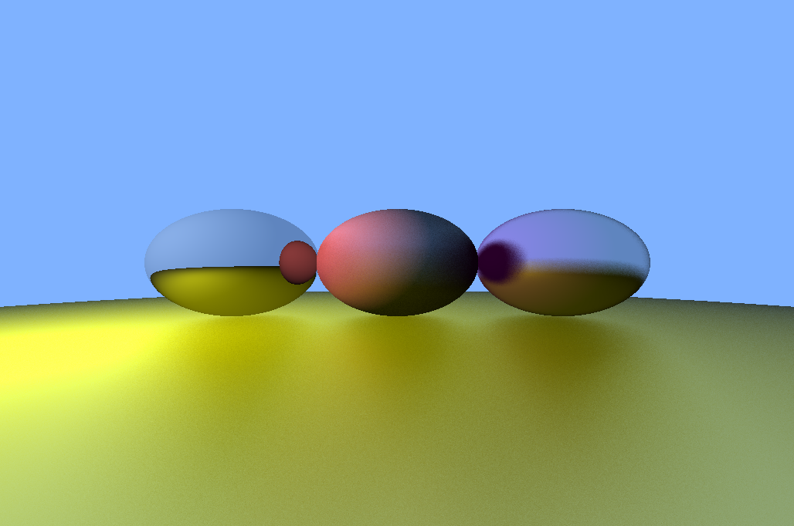

# Phoenix Raytracer

A real time raytracer built on top of the Phoenix Engine

This project is ment to be used as an example of how to use the Phoenix Engine for your own project and of learning to make a real time raytracer

## How to run

Instructions on how to run this are the same as [Phoenix Engine](https://github.com/thez0ne/Phoenix-Engine/). Follow the intructions to compile the projects and run `Raytracer` instead of `Sandbox`

## Future Additions

- [ ] Better Camera Movement using WASD
- [ ] Scene Serialization, to load and save scenes to a file

